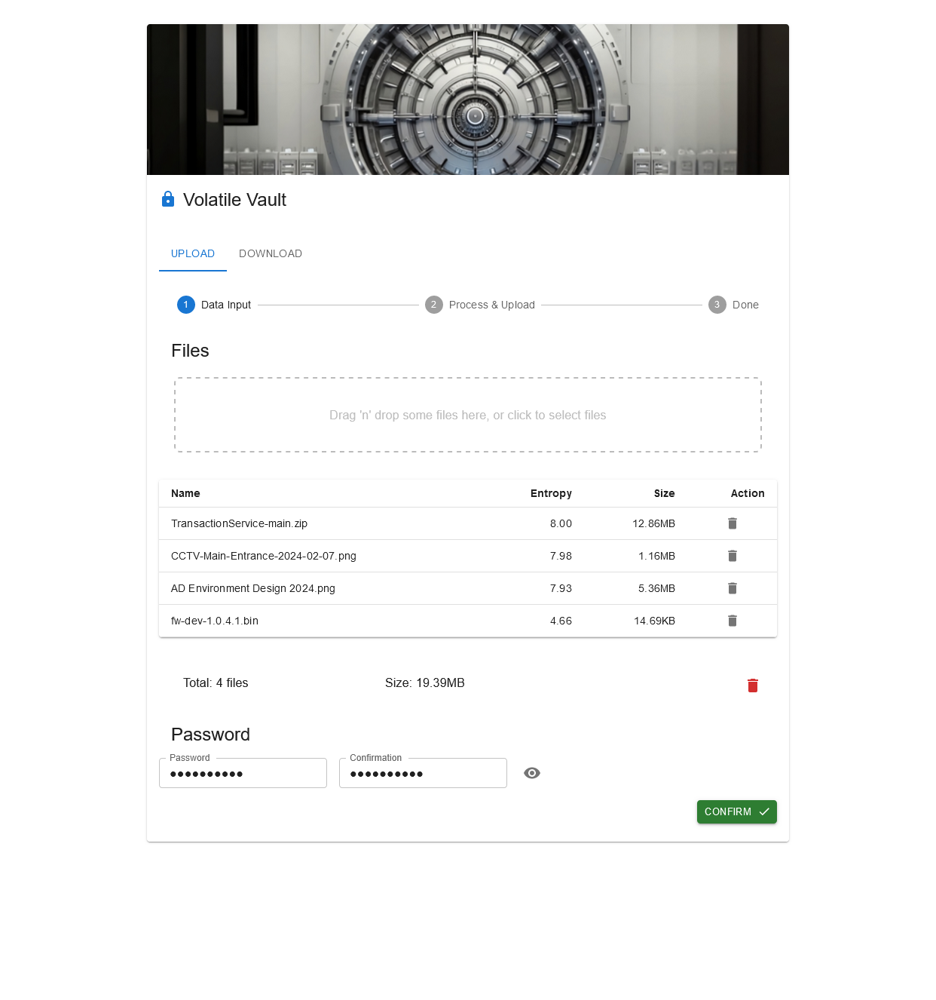
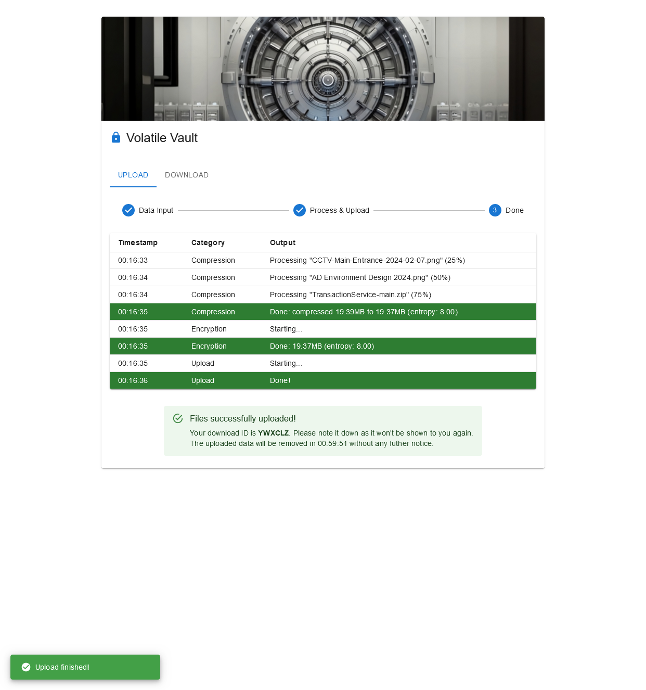
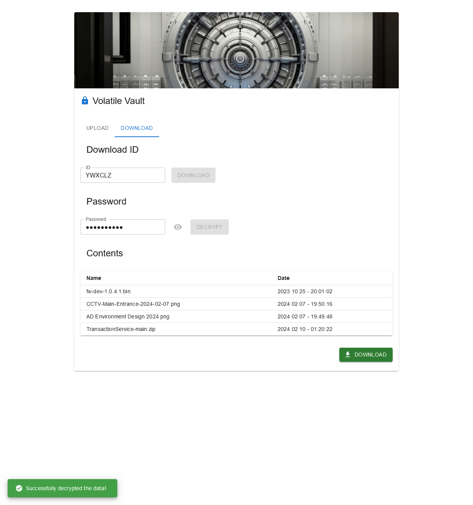

  
  <h1>Volatile Vault</h1>
   

  
<i>Volatile Vault is a secure data exfiltration & dropper platform for Red Team Operators by <a href="https://github.com/molatho">@molatho</a> &amp; <a href="https://github.com/Patrick-DE">@secdude</a>.</i>

  
<i>Inspired by <a href="https://github.com/sc0tfree/updog">updog</a>.</i>

   
  

# Screenshots

  
  
  

# Use Cases

- **Data exfiltration**: Operators can upload sensitive files from compromised target systems to exfiltrate data securely, without any reliance on potentially untrustworthy third-parties.
- **Dropping implants**: Operators can upload implants from their machines and download them on target systems and leverage HTML smuggling to more covertly transmit and deploy their implants.

# Features

- **Security first**: All data is encrypted/decrypted (using AES-GCM) and compressed/decompressed (ZIP DEFLATE) in the browser, no sensitive data hits the backend in plain text and no potentially sensitive key material ever leaves the browser.
- **Volatile storage**: All uploaded data has a preconfigured life-time (e.g. one hour) after which it gets deleted on the server side. Any previously stored encrypted blobs are removed on the server side upon startup of the server application.
- **AWS integration**: Volatile Vault can spin up and configure CloudFront distributions to proxy web traffic for uploads & downloads. Furthermore it can create S3 buckets and upload file to and from them!
- **TOTP authentication**: Access to the service is granted by using a shared secret for TOTP authentication, making it easy to use and more resilient to credential leakage.
- **Configurable**: Specifics such as the maximum allowed file size and life time of uploaded blobs can be configured in the [server](server/README.md)'s `config.yml` file before deployment of the application.
- **Chunks + HTTPS redirectors**: Upload the encrypted blobs in chunks via a range of HTTP redirectors pointing to the service.
- **Plugin system**: You can freely configure how data is uploaded/downloaded and where it is stored thanks to Volatile Vault's plugin system which allows the integration of multiple file storages and exfiltration mechanisms.

## Plugin Concept

Volatile Vault allows you to mix and match plugins for file storages ("storages") and exfiltration mechanisms ("exfils") to your heart's content. Storages are plugins that store and retrieve files - this could be the server's filesystem or a cloud storage such as AWS S3. Exfils are data transports that allow you to upload and download files to and from Volatile Vault - this could be a simple built-in HTTP transport or an entirely different protocol such as QUIC.

You can specify which storages and exfils to use by configuring them in (or ommitting them from) your [server](server/README.md)'s configuration.

## Roadmap

- **Rate limiting**: Limit the upload speed to the service so uploads won't be as easy to detect as bursts.
- **Password-encrypted Archives**: Encrypt the archives themselves so they can't be read in plain text on disk.
- **Duplicate plugin instances**: Allow plugins to be initialized and used multiple times instead of once per implementation.

## FAQs

Here are some Q&A's addressing Volatile Vault's shortcomings:

> Q: Can we have multiple users?

A: No. The declared goal of this app was to provide an easy-to-use and secure platform to exfiltrate data. It is meant to be used by small teams and for individual assessments, as part of your typical burner infrastructure, only.

> Q: Why does this use TOTP?

A: TOTP was chosen for its simplicity and implications for security: it's easy to set up (both parties only need to know the shared TOTP secret) and even if a SoC gets ahold of submitted tokens there's only a very brief time window in which they can re-use it.

> Q: Why do I need to enter the TOTP every time I open/refresh the page? Can't use our session after authenticating?

A: This application is not meant to be used over long time periods but only for exfiltrating data in select instances. Furthermore, by avoiding saving cookies or using localStorage, its footprint on the target system is reduced even further.

# Usage / Installation

## Deployment

1. Install Docker: `docker` and `docker compose` (ref [Install Docker Engine](https://docs.docker.com/engine/install/))
2. **Configure the [server](server/README.md)** (seriously, you can't skip this) and [client](client/README.md)
3. Build and start the container by running `docker compose -f docker-compose.prod.yml up`

## Development

1. Install Node.js (v20+): `node` and `npm` (ref [Download Node.js](https://nodejs.org/en/download/package-manager))
2. Install node dependencies of the client and server by `cd`'ing into their respective subdirectories and issuing `npm i`
3. **Configure the [server](server/README.md)** and [client](client/README.md)
4. Start the [server](ref) and [client](ref)

# Contributing

Pull requests are very welcome!
