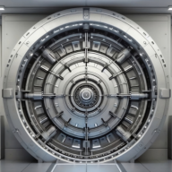

<div align="center">
  
  <h1>Volatile Vault - FileSystem Storage</h1>
  <br/>
</div>

This storage allows Volatile Vault to store files to and retrieve them from its harddrive.

# Configuration

Example:

```yaml
---
storage:
  filesystem:
    folder: './files_basic'
    max_size: 104857600
    file_expiry: 60
```

Fields:

- `folder`: Absolute or relative folder to store files in.
- `max_size`: Maximum allows size of files to store.
- `file_expiry`: Duration (in minutes) after which files will be removed automatically.
